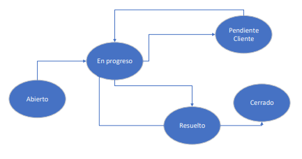

## CalcularDemoraResolucion (FUNCTION)
Dado el ID de un ticket, determina el tiempo que tardó en ser resuelto. En caso de que el ticket no haya sido resuelto aun devolverá 0.

Input:
* @idTicket (int)

Output: 
* Tiempo que tardó en resolverse expresado en horas (int)

## CambiarEstodoDeTicket (PROCEDURE)

Dado el ID de un Ticket y el ID de un nuevo estado, actualiza dicho estado siguiendo las reglas del diagrama de flujo.

Input: 
* @idTicket (int)
* @idEstado (varchar(2))

Errores:
* El store procedure arrojara un error si el cambio de estado no cumple con las reglas establecidas por el diagrama.

## CrearCliente (PROCEDURE)

Crea un cliente como prospecto dentro de la base de datos.

Input: 
* @nombre (varchar(255))
* @apellido (varchar(255))
* @tipoDocumento (varchar(25))
* @nroDocumento (varchar(255))
* @fechaNacimiento date
* @email (varchar(255))

Errores:
* El procedimiento arrojará un error si el cliente es menor de edad.

## CrearServicio (PROCEDURE)

Crea un servicio para un cliente en la base de datos.

Input:
* @idTipoServicio (char(2))
* @idCliente (int)
* @telefono (int)
* @calle (varchar(255))
* @altura (int)
* @piso (int)
* @depto (varchar(5))

Errores:
* El procedimiento arrojará un error si el cliente no tiene registrado un correo electrónico o una fecha de nacimiento en la base de datos.

Notas:
* La fecha de inicio del servicio se establece automáticamente como la fecha actual.
* El estado inicial del servicio es 'AC' (Activo).

## CrearTicket (PROCEDURE)

Crea un nuevo ticket para un servicio en la base de datos.

Input:
* @idTipologia (VARCHAR(2))
* @nroServicio (INT)
* @idUsuario (INT)

Errores:
* El procedimiento arrojará un error si no existe una tipología para el servicio proporcionado.

Notas:
* La fecha de apertura del ticket se establece automáticamente como la fecha actual.
* El estado inicial del ticket es 'AB' (Abierto).
* El campo 'Login' se establece como 'amartinez' por defecto.

## EditarCliente (PROCEDURE)

Edita la información de un cliente en la base de datos.

Input:
* @idCliente (INT)
* @nombre (VARCHAR(255))
* @apellido (VARCHAR(255))
* @fechaNacimiento (DATE)

Errores:
* El procedimiento arrojará un error si se intenta editar un cliente que está activo (con estado 'AC').

Notas:
* La edición de la información incluye el nombre, apellido y fecha de nacimiento del cliente.
* Solo se permite editar clientes que no estén activos.

## ExistetTipologiaParaServicio (FUNCTION)

Verifica la existencia de una tipología para un servicio específico en la base de datos.

Input:
* @nroServicio (INT)
* @idTipologia (VARCHAR(2))

Output:
* Retorna un valor bit (0 o 1) indicando si existe o no una tipología para el servicio proporcionado.

Notas:
* La función utiliza la tabla 'ServiciosContratados' para obtener el 'IdServicio' correspondiente al 'NroServicio' proporcionado.
* Luego, verifica en la tabla 'SLA' si hay alguna entrada que coincida con el 'IdServicio' y la 'IdTipologia'.
* Si encuentra al menos una coincidencia, establece el valor de retorno como 1, indicando que la tipología existe para el servicio.

## InactivarServicio (PROCEDURE)

Inactiva un servicio en la base de datos.

Input:
* @idServicio (INT)

Acciones:
* Actualiza el estado del servicio (en la tabla 'ServiciosContratados') a 'IN' (Inactivo).
* Verifica la cantidad de servicios activos para el cliente asociado al servicio inactivado.
* Si la cantidad de servicios activos para ese cliente es cero, actualiza el estado del cliente (en la tabla 'Clientes') a 'IN' (Inactivo).

## InsertarEnHistorial (TRIGGER)

Este desencadenador (trigger) se activa después de una actualización en la tabla 'Tickets' y registra en la tabla 'HistorialEstados' los cambios en el estado de un ticket.

Acciones:
* Obtiene el nuevo estado del ticket ('IdEstado') de la tabla 'inserted'.
* Obtiene el estado anterior del ticket ('IdEstado' antes de la actualización) de la tabla 'deleted'.
* Obtiene el ID del ticket ('Id') de la tabla 'inserted'.
* Obtiene la fecha y hora actual.
* Compara el nuevo estado con el estado anterior.
* Si hay un cambio en el estado, inserta un registro en la tabla 'HistorialEstados' con el estado anterior, el nuevo estado, el ID del ticket y la fecha y hora de inicio del cambio.

## ReasignarTicket (PROCEDURE)

Reasigna un ticket a un cliente específico en la base de datos.

Input:
* @idTicket (INT)
* @idCliente (INT)

Errores:
* El procedimiento arrojará un error si se intenta asignar un ticket a un cliente que está inactivo (con estado 'IN').

Acciones:
* Actualiza el campo 'IdCliente' en la tabla 'Tickets' con el nuevo valor proporcionado para el ticket especificado.

## ValidarFechaMayorEdad (FUNCTION)

Valida si la fecha de nacimiento proporcionada corresponde a una persona mayor de 18 años.

Input:
* @fechaNacimiento (DATE)

Output:
* Retorna un valor bit (0 o 1) indicando si la persona es mayor de 18 años o no.

Notas:
* La función utiliza la función DATEDIFF para calcular la diferencia en años entre la fecha de nacimiento proporcionada y la fecha actual.
* Si la diferencia es mayor que 18, se establece el valor de retorno como 1, indicando que la persona es mayor de edad.